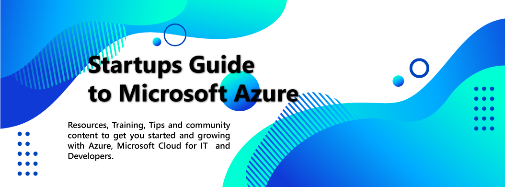
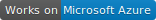

# 

    A list of resources & training to get your startup up and running on <a href="https://azure.microsoft.com">Microsoft Azure.</a>

 <a href="#get-started-with-azure-🏁">🏁 Get started</a> |
 <a href="#what-you-can-do-with-the-azure-free-services-🆓">🆓 Free services</a> |
 <a href="#azure-by-technology-areas">👩‍💻 By Technology Area</a>

&nbsp;

This repo provides startups with Azure guidance, information, and resources. Whether you're creating something brand new, you're considering a move from another cloud provider, you want to leverage Azure services, you're refactoring your architecture, or you're throwing everything away and starting over, this guide will help you.

**Table of contents**

- [Get Started with Azure](#get-started-with-azure-🏁)
- [What you can do with the Azure Free services?](#what-you-can-do-with-the-azure-free-services-🆓)
- [What you can do can build the area you're looking at?](#azure-by-technology-areas)
    - 👩‍💻 Developer
    - ⚡ Serverless
    - DevOps
    - 🌐 Web Apps
    - 💾 Storage
    - 🗄️ Databases
    - 🧪 AI & ML
    - 🚚 Big Data
    - 🛸 IoT
    - [Mapping AWS to Azure ☁️➡️☁️](#mapping-aws-to-azure)
- [About this repository](#about-this-repository)

> In this document, we are providing information about our free tiers and/or offerings. Please note that this document may not reflect an accurate description of our free offerings, and may from time to time describe a free offering which is not free anymore. Information listed here has no legal or contractual value. Please consult our [Azure Free Tier Page](https://azure.microsoft.com/en-us/free/) for accurate and up-to-date info.

## Get started with Azure 🏁
You can quickly get started with Azure by [creating a free account](https://azure.microsoft.com/en-us/). The free account includes access to 25 different products that are always free. You also get free access to popular Azure products for 12 months. And you get a $200 credit to spend in the first month. For the latest details on the free Azure account, consult the [Azure Free Account FAQ](https://azure.microsoft.com/en-us/free/free-account-faq/).

If you already have an Azure subscription, you don't need to create a new account.

Are you a startup? You may be eligible to [Microsoft for Startups](https://startups.microsoft.com/learn/?wt.mc_id=startups-github-cxa) program.

## What you can do with the Azure Free services? 🆓
Azure has a broad range of products that cover many different scenarios, capabilities, and needs. With a free account, you get access to two tiers of products, *free* and *free for 12 months*:

- [Products that are always free](products/azure-products-free.md)
- [Products that are free for 12 months](products/azure-products-free-trial.md)

With an Azure subscription, you get access to all of the free products and the products that are pay-as-you-go.

You can build a a lot of different services only using the free tier! Let's see some examples:

- 🌐 Want to build a simple website with an SQL database? Deploy it with [Azure Web Apps](https://azure.microsoft.com/services/app-service/web/) and [Azure SQL](https://azure.microsoft.com/services/sql-database/).
 [👩‍🎓 Learn how to deploy your website on Azure Web Apps](https://docs.microsoft.com/learn/paths/deploy-a-website-with-azure-app-service/)
 [👩‍🎓 Learn how to use Azure SQL Database](https://docs.microsoft.com/learn/modules/provision-azure-sql-db/)

- ⚡ Want to build a real-time application? You can do this with [Azure SignalR Service](https://azure.microsoft.com/services/signalr-service/), [Azure Functions](https://azure.microsoft.com/services/functions/) and [CosmosDB](https://azure.microsoft.com/services/cosmos-db/) free tiers.
 [👩‍🎓 Learn how to work with Azure CosmosDB Database](https://docs.microsoft.com/learn/paths/work-with-nosql-data-in-azure-cosmos-db/)
 [👩‍🎓 Learn how to develop APIs with Azure Functions](https://docs.microsoft.com/learn/modules/build-api-azure-functions/)
 [👩‍🎓 Learn how to enable automatic udpates with SignalR](https://docs.microsoft.com/learn/modules/automatic-update-of-a-webapp-using-azure-functions-and-signalr/)
 [📐Reference architecture: Real-Time dashboard](https://docs.microsoft.com/azure/architecture/solution-ideas/articles/real-time-web-dashboard)
 [📐Reference architecture: Cross-platform Chat](https://docs.microsoft.com/azure/architecture/solution-ideas/articles/cross-platform-chat)

### You have your first customer? 🙌
Free services are not limited to development or testing (see our [Free Services FAQ](https://azure.microsoft.com/free/free-account-faq/)). So yes, you may go into production with our free services. Be sure to check if the limits & availability of used services are sufficient for your use case before. Also, please note that you'll not be eligible to refunds if there is any SLA breach. Check out our [SLA documentation](https://azure.microsoft.com/free/free-account-faq/) for more information.

## Azure by technology areas

### DevOps

With GitHub and Azure DevOps, you can simply organize, build & test the work of your team.

> **Our free tier includes**:
>
> - 5 first users of Azure DevOps,
> - 1800 Build & release pipelines minutes per month
> - Free private GitHub repositories, with unlimited collaborators and 2000 GitHub actions minutes

[Get started for free](https://docs.microsoft.com/azure/devops/user-guide/sign-up-invite-teammates?view=azure-devops&wt.mc_id=microsoftstartups-github-chmaneu) | [Learn how to build your apps with Azure DevOps](https://docs.microsoft.com/learn/paths/build-applications-with-azure-devops/?wt.mc_id=microsoftstartups-github-chmaneu)

### Developer Experience

 - [Get a development Box on Azure with Visual Studio Online](https://online.visualstudio.com/?wt.mc_id=microsoftstartups-github-chmaneu)

### Serverless Computing

- [Create serverless logic with Azure Functions](https://docs.microsoft.com/learn/modules/create-serverless-logic-with-azure-functions/?wt.mc_id=microsoftstartups-github-chmaneu)
- [Build a CRUD API with Severless](https://scotch.io/tutorials/crud-with-azure-serverless-functions)
- [Create a long-running serverless workflow with Durable Functions](https://docs.microsoft.com/learn/modules/create-long-running-serverless-workflow-with-durable-functions/?wt.mc_id=microsoftstartups-github-chmaneu)
- [Stateful Serverless with Durable Functions](https://dev.to/azure/stateful-serverless-with-durable-functions-2jff)
- [Is Serverless really as cheap as everyone claims?](https://dev.to/azure/is-serverless-really-as-cheap-as-everyone-claims-4i9n)
- [Azure Functions](https://docs.microsoft.com/users/msignite2019/collections/erxh5dgozrqx?WT.mc_id=microsoftstartups-github-bramin)
- [Azure Logic Apps](https://azure.microsoft.com/services/logic-apps?WT.mc_id=microsoftstartups-github-bramin)
- [Use Azure Functions to build a Serverless API backend for Slack](https://dev.to/azure/funcy-a-serverless-slack-app-using-azure-functions-4m84)
- [Use Azure Functions and Azure Event Hubs for real-time data processing](https://dev.to/azure/tutorial-use-azure-functions-to-process-real-time-data-from-azure-event-hubs-and-persist-to-azure-cosmos-db-2co8)

### DevOps

- TBD

### Web apps

 - [Host a static website on Azure]()
 - [Host your containerized web app on Azure]()

### Storage

 - [Implement and manage Azure Storages](resources/learning-resources.md#storage)

### Databases

 - [Choosing Open Source databases on Azure - MySQL, PostgreSQL, MariaDB & Redis](resources/learning-resources.md#databases)
 - [Build a globally distributed database with Azure CosmoDB](resources/learning-resources.md#databases)

### Internet of Things (IoT)

- [Send and Read Telemtry Data to Azure IoT Hub](https://docs.microsoft.com/en-us/azure/iot-hub/quickstart-send-telemetry-cli?wt.mc_id=microsoftstartups-github-chmaneu)
- [Control IoT Devices using IoT Hub](https://docs.microsoft.com/en-us/azure/iot-hub/quickstart-control-device-node?wt.mc_id=microsoftstartups-github-chmaneu)

### Big Data

- [Getting started with big data ingestion and streaming on Azure](https://docs.microsoft.com/azure/azure-databricks/databricks-stream-from-eventhubs?WT.mc_id=microsoftstartups-github-alehall)
- [Running Apache Spark jobs on Azure Kubernetes Service](https://docs.microsoft.com/azure/aks/spark-job?WT.mc_id=microsoftstartups-github-alehall)
- [How to choose Azure services to work with messages in your application](aka.ms/azfr/626/yt)
- [Apache Kafka developer guide for Azure Event Hubs](https://docs.microsoft.com/en-us/azure/event-hubs/apache-kafka-developer-guide)
- [What to consider for painless Apache Kafka integration](https://www.freecodecamp.org/news/what-to-consider-for-painless-apache-kafka-integration-df559e828876/)
- [Build a Kafka Streams application for data processing and deploy it to Kubernetes](https://dev.to/azure/learn-how-to-develop-a-kafka-streams-application-for-data-processing-and-deploy-it-to-kubernetes-25li)
- [Azure Event Hubs multi-protocol support](https://dev.to/azure/azure-event-hubs-multi-protocol-support-4idd)

### AI & ML

 - [Build bots in Minutes](resources/learning-resources.md#ai-and-ml)
 - [Building intelligent applications using Pre-Built AI for beginners](resources/learning-resources.md#ai-and-ml)
 - [Build Custom Vision AI in minutes](resources/learning-resources.md#ai-and-ml)
 - [No-code Machine Learning with simple Drag-n-Drop designer for beginners](resources/learning-resources.md#ai-and-ml)
 - [Introduction to Machine Learning](resources/learning-resources.md#ai-and-ml)

### Mapping AWS to Azure
Here is a comparison of the services on AWS and Azure. https://docs.microsoft.com/en-us/azure/architecture/aws-professional/services?wt.mc_id=microsoftstartups-github-chmaneu

## About this repository

### License

This content is shared under MIT license.

### Contributing

We welcome your contributions on this page! There is several ways to contribute:

 - **You need some info about a product or a use case?** [Create an issue](https://github.com/microsoft/startups/issues/new)
 - **You have a content to submit?** Please create a pull request and we'll review it.
 - **You have an experience to share?** You can start by [creating an issue](https://github.com/microsoft/startups/issues/new) and we can see how best transcribe your experience and knowledge here.

### Contributors ✨

Thanks goes to these wonderful people:

<table>
  <tr>
    <td align="center"><a href="https://github.com/ruyakubu"> <b>Ruth Yakubu</b>&nbsp; </a> <a href="https://github.com/microsoft/startups/commits?author=ruyakubu" title="Documentation">📖</a> <a href="https://github.com/microsoft/startups/pulls?q=is%3Apr+reviewed-by%3Aruyakubu" title="Reviewed Pull Requests">👀</a></td>
    <td align="center"><a href="https://maneu.net"> <b>Chris Maneu</b>&nbsp; </a> <a href="https://github.com/microsoft/startups/commits?author=cmaneu" title="Documentation">📖</a> <a href="https://github.com/microsoft/startups/pulls?q=is%3Apr+reviewed-by%3Acmaneu" title="Reviewed Pull Requests">👀</a></td>
    <td align="center"><a href="https://github.com/lenadroid"> <b>Lena Hall</b>&nbsp; </a> <a href="https://github.com/microsoft/startups/commits?author=lenadroid" title="Documentation">📖</a></td>
    <td align="center"><a href="https://github.com/christiannwamba"> <b>Chris Nwamba</b>&nbsp; </a> <a href="https://github.com/microsoft/startups/commits?author=christiannwamba" title="Documentation">📖</a></td>
    <td align="center"><a href="https://github.com/revodavid"> <b>David Smith</b>&nbsp; </a> <a href="https://github.com/microsoft/startups/commits?author=revodavid" title="Documentation">📖</a></td>
    <td align="center"><a href="https://github.com/brminnick"> <b>Brandon Minnick</b>&nbsp; </a> <a href="https://github.com/microsoft/startups/commits?author=brminnick" title="Documentation">📖</a></td>
  </tr>
  <tr>
<td align="center"><a href="https://github.com/abhirockzz"> <b>Abhishek Gupta</b>&nbsp; </a> <a href="https://github.com/microsoft/startups/commits?author=abhirockzz" title="Documentation">📖</a></td>
<td align="center"><a href="https://github.com/robstand"> <b>Robert Standefer</b>&nbsp; </a> <a href="https://github.com/microsoft/startups/commits?author=robstand" title="Documentation">📖</a><a href="https://github.com/microsoft/startups/pulls?q=is%3Apr+reviewed-by%3Arobstand" title="Reviewed Pull Requests">👀</a></td>
  </tr>
</table>

### Code of Conduct

This project has adopted the [Microsoft Open Source Code of Conduct](https://opensource.microsoft.com/codeofconduct/). For more information see the [Code of Conduct FAQ](https://opensource.microsoft.com/codeofconduct/faq/) or contact [opencode@microsoft.com](mailto:opencode@microsoft.com) with any additional questions or comments.
