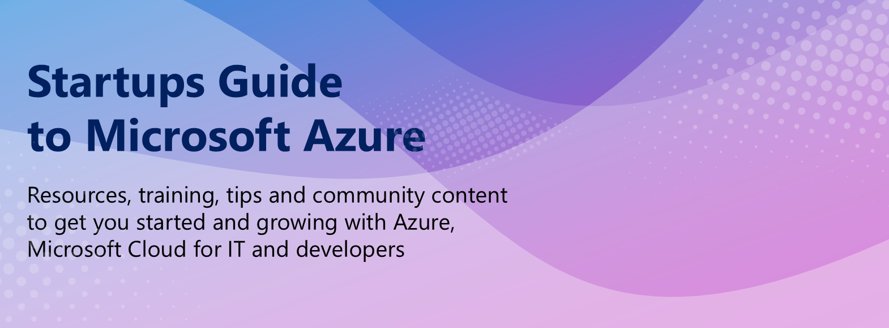

# Microsoft for Startups — Developer Hub

A developer-first collection of guided paths, curated link indexes,
and prompt routing pages to help startup developers build, scale,
and ship on Azure.

This repo is a router, not a source of truth.
For pricing, credits, and service entitlements, always follow the
official sources linked below.

---

## 🚀 Start here

[Start here](./START_HERE.md)

---

## Guided paths

| Path | Who it's for |
|---|---|
| [00-start-here](./paths/00-start-here/) | Every startup new to Azure + MfS |
| [01-build-fast](./paths/01-build-fast/) | Early-stage builders shipping first workloads |
| [02-scale-smart](./paths/02-scale-smart/) | Growing startups moving to production |
| [03-sell-more](./paths/03-sell-more/) | GTM-ready startups targeting enterprise |
| [04-ai-agents](./paths/04-ai-agents/) | Founders building with Foundry + agent frameworks |
| [05-enterprise-readiness](./paths/05-enterprise-readiness/) | Startups preparing for enterprise security reviews |

---

## 📦 Monthly featured drop

[May 2026 Build edition](./paths/featured/2026-05-build/)

---

## 🗂️ Browse by vertical

[Vertical index](./verticals/README.md)

| Vertical | Folder |
|---|---|
| [Health & Life Sciences](./verticals/regulated-industries/healthcare-life-sciences.md) | Enterprise healthcare and life sciences scenarios |
| [FSI (Financial Services)](./verticals/regulated-industries/fintech.md) | Regulated financial services and fintech offerings |
| [Cybersecurity](./verticals/security-privacy-trust/) | Security, privacy, and trust guidance |
| [Retail](./verticals/commerce-media-cx/) | Commerce and customer experience scenarios |
| [Data & AI / DevTools](./verticals/devtools-horizontal-saas/) | Data, AI, and developer platform guidance |

---

## 📚 Indexes (canonical link catalogs)

| Index | What it covers |
|---|---|
| [Learn index](./index/learn.md) | Microsoft Learn content relevant to startup developers |
| [Reference repos](./index/reference-repos.md) | Product-team GitHub repos worth following |
| [Agent skills](./index/agent-skills.md) | MicrosoftDocs/Agent-Skills and related resources |
| [MCP server](./index/mcp.md) | MCP server pointers for in-workflow learning |

---

## 🤖 AEO prompt routing pages

Short answers + canonical sources for common founder questions.

[AEOS prompt routing](./aeo/README.md)

---

## 🛠️ Workshops + partner drops

[Workshops](./workshops/README.md)

---

## 🤝 Contributing

[Contributing guide](./CONTRIBUTING.md)

[Governance](./GOVERNANCE.md)

---

*This repo organizes paths and links to official documentation and
maintained repositories. It does not provide authoritative guidance
on pricing, credits, or service entitlements. Always follow the
official sources linked above.*
